# DriveXcel (KMP — Android & Desktop)

Приложение что работает с Excel таблицами для отметки пользователей на мероприятия

<div>
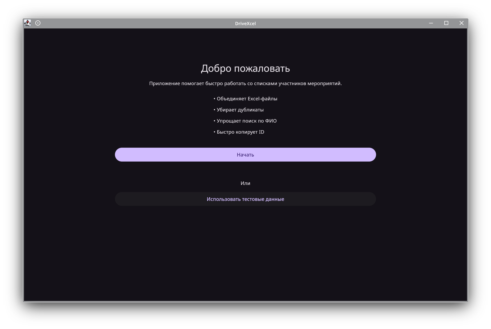
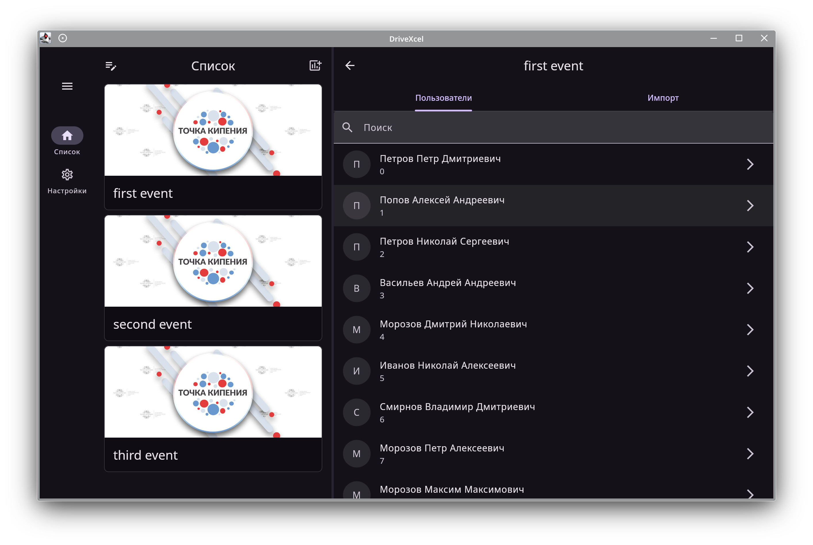
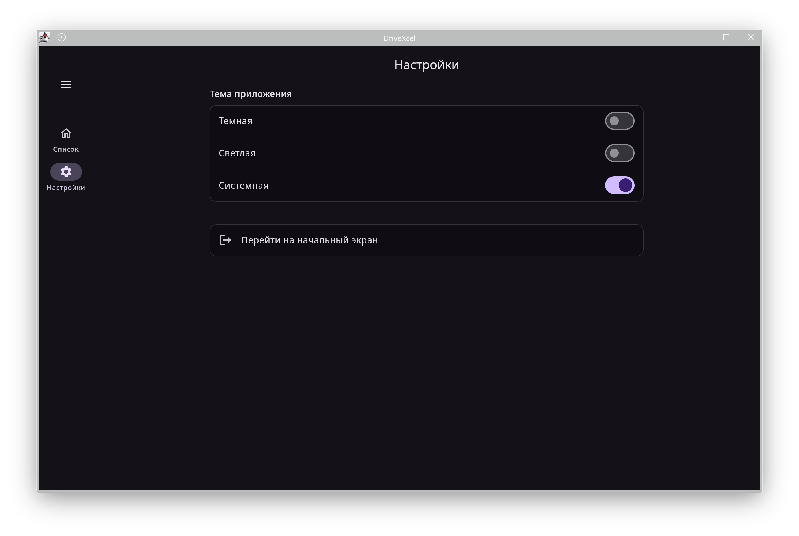
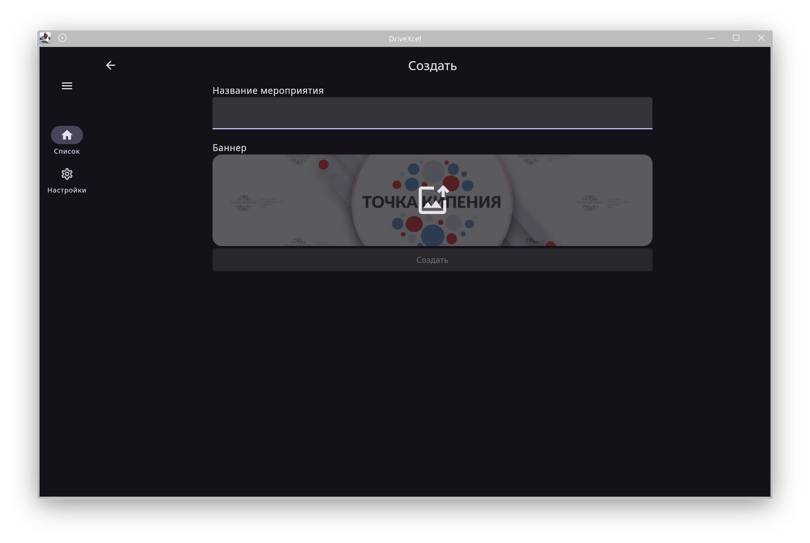
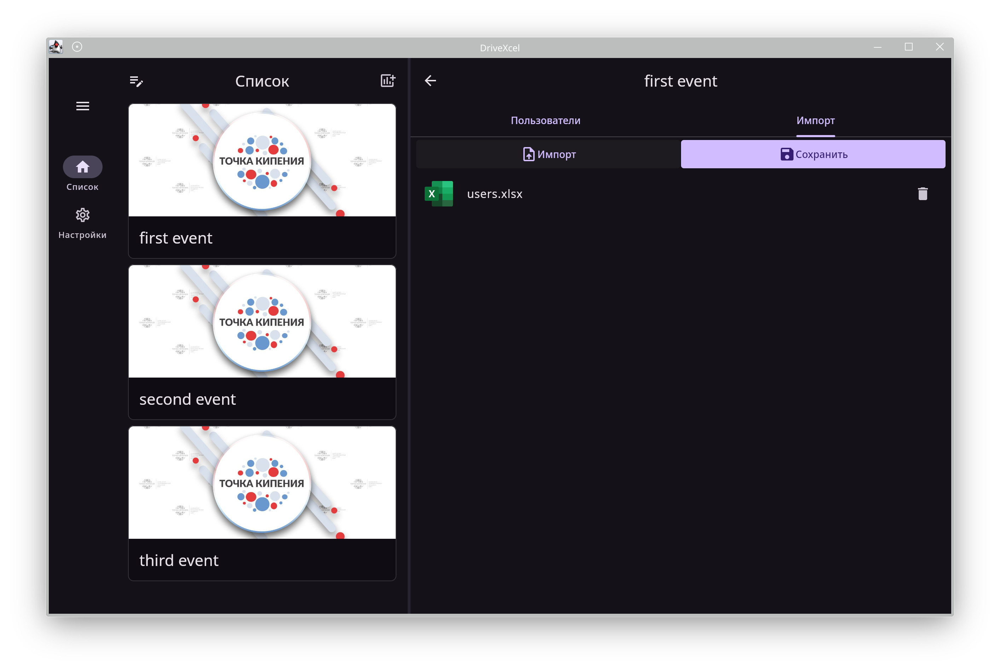
</div>

<div>
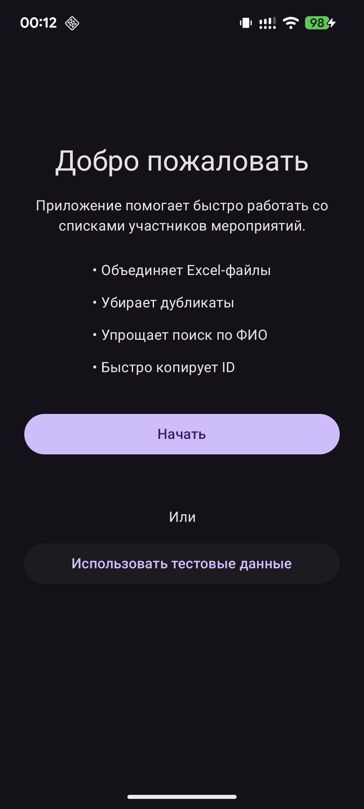
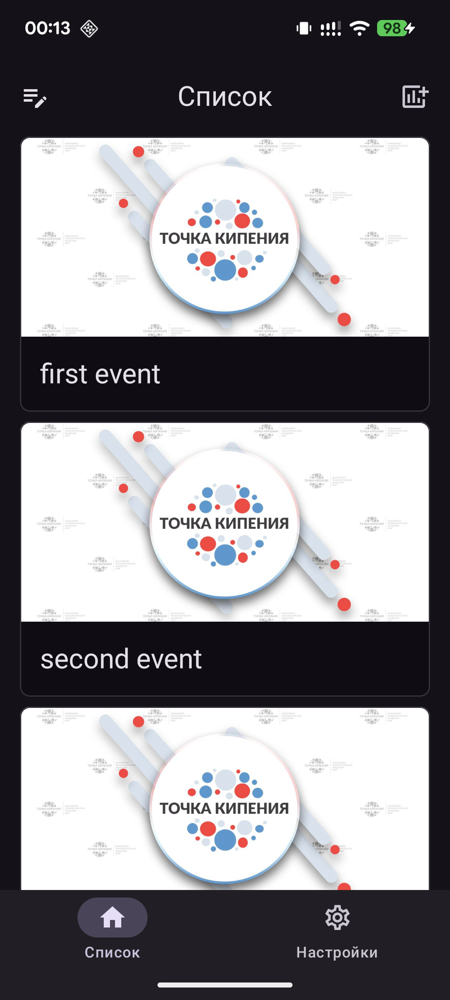
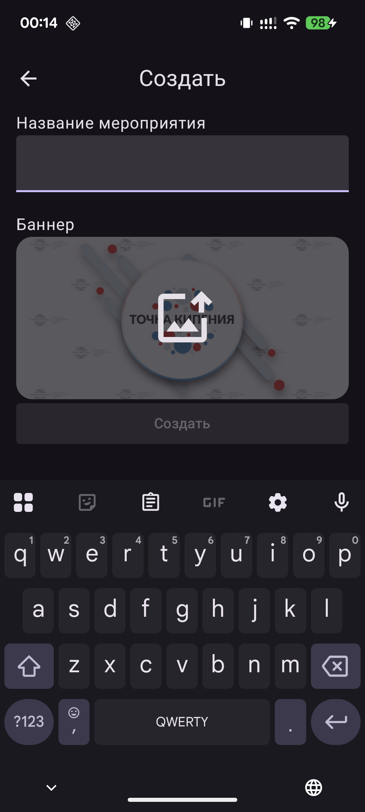
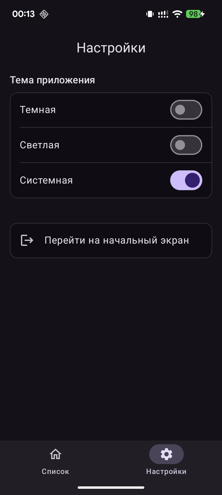
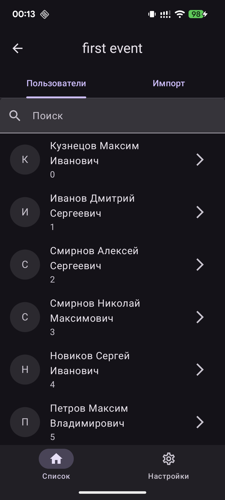
</div>

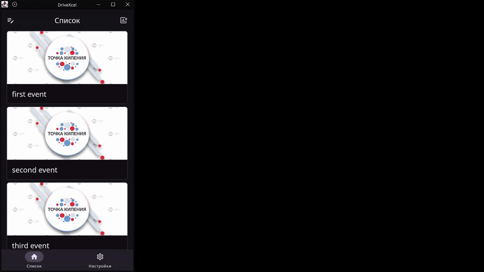


## Идея создания

Идея создания приложения возникла в процессе работы. Я работаю в Точке кипения ИТА ЮФУ, где часто проходят мероприятия одного формата, и на них обычно приходят одни и те же участники.

Перед началом мероприятия каждого нужно найти в системе Leader-ID и отметить. 
На практике это не очень быстрый процесс: люди часто приходят почти одновременно, образуется очередь, и приходится вручную искать каждого по ФИО. 
При этом поиск чувствителен к тому, как именно введены данные — если перепутать порядок или допустить небольшую ошибку, найти человека становится сложнее.

В итоге на простую задачу уходит больше времени, чем хотелось бы.

Мне стало интересно, можно ли это упростить и ускорить, поэтому появилась идея сделать приложение, которое поможет быстрее находить участников — например, за счёт более гибкого поиска.

## Принцип работы

This is a Kotlin Multiplatform project targeting Android, Desktop (JVM).

* [/composeApp](./composeApp/src) is for code that will be shared across your Compose Multiplatform applications.
  It contains several subfolders:
  - [commonMain](./composeApp/src/commonMain/kotlin) is for code that’s common for all targets.
  - Other folders are for Kotlin code that will be compiled for only the platform indicated in the folder name.
    For example, if you want to use Apple’s CoreCrypto for the iOS part of your Kotlin app,
    the [iosMain](./composeApp/src/iosMain/kotlin) folder would be the right place for such calls.
    Similarly, if you want to edit the Desktop (JVM) specific part, the [jvmMain](./composeApp/src/jvmMain/kotlin)
    folder is the appropriate location.

### Build and Run Android Application

To build and run the development version of the Android app, use the run configuration from the run widget
in your IDE’s toolbar or build it directly from the terminal:
- on macOS/Linux
  ```shell
  ./gradlew :composeApp:assembleDebug
  ```
- on Windows
  ```shell
  .\gradlew.bat :composeApp:assembleDebug
  ```

### Build and Run Desktop (JVM) Application

To build and run the development version of the desktop app, use the run configuration from the run widget
in your IDE’s toolbar or run it directly from the terminal:
- on macOS/Linux
  ```shell
  ./gradlew :composeApp:run
  ```
- on Windows
  ```shell
  .\gradlew.bat :composeApp:run
  ```

---

Learn more about [Kotlin Multiplatform](https://www.jetbrains.com/help/kotlin-multiplatform-dev/get-started.html)…